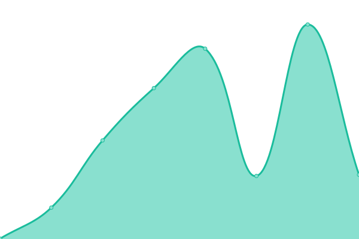
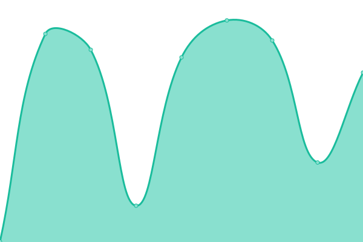

# [📈 Live Status](https://diegoaces.github.io/greenbot_status): <!--live status--> **🟩 All systems operational**

This repository contains the open-source uptime monitor and status page for [Diego Acuña](https://diegoaces.github.io/greenbot_status), powered by [Upptime](https://github.com/upptime/upptime).

With [Upptime](https://upptime.js.org), you can get your own unlimited and free uptime monitor and status page, powered entirely by a GitHub repository. We use [Issues](https://github.com/diegoaces/greenbot_status/issues) as incident reports, [Actions](https://github.com/diegoaces/greenbot_status/actions) as uptime monitors, and [Pages](https://diegoaces.github.io/greenbot_status) for the status page.

<!--start: status pages-->
<!-- This summary is generated by Upptime (https://github.com/upptime/upptime) -->
<!-- Do not edit this manually, your changes will be overwritten -->
<!-- prettier-ignore -->
| URL | Status | History | Response Time | Uptime |
| --- | ------ | ------- | ------------- | ------ |
|  [Greenbot Labs](https://greenbot.cl) | 🟩 Up | [greenbot-labs.yml](https://github.com/diegoaces/greenbot_status/commits/HEAD/history/greenbot-labs.yml) | 

 1091ms
     
 | 

<a href="https://diegoaces.github.io/greenbot_status/history/greenbot-labs">100.00%</a>
    

|  [Reportabilidad Page](https://reportabilidad.cl) | 🟩 Up | [reportabilidad-page.yml](https://github.com/diegoaces/greenbot_status/commits/HEAD/history/reportabilidad-page.yml) | 

 363ms
     
 | 

<a href="https://diegoaces.github.io/greenbot_status/history/reportabilidad-page">100.00%</a>
    

|  [Reportabilidad Tenant Page](https://public.reportabilidad.cl) | 🟩 Up | [reportabilidad-tenant-page.yml](https://github.com/diegoaces/greenbot_status/commits/HEAD/history/reportabilidad-tenant-page.yml) | 

 1011ms
     
 | 

<a href="https://diegoaces.github.io/greenbot_status/history/reportabilidad-tenant-page">100.00%</a>
    

|  [Bosque Digital](https://bosquedigital.cl) | 🟩 Up | [bosque-digital.yml](https://github.com/diegoaces/greenbot_status/commits/HEAD/history/bosque-digital.yml) | 

 1424ms
     
 | 

<a href="https://diegoaces.github.io/greenbot_status/history/bosque-digital">100.00%</a>
    

|  [TMC](https://tmcforestal.cl) | 🟩 Up | [tmc.yml](https://github.com/diegoaces/greenbot_status/commits/HEAD/history/tmc.yml) | 

 3024ms
     
 | 

<a href="https://diegoaces.github.io/greenbot_status/history/tmc">99.91%</a>
    

|  [BD Chillán](https://mosaicos.bosquedigital.cl) | 🟩 Up | [bd-chillan.yml](https://github.com/diegoaces/greenbot_status/commits/HEAD/history/bd-chillan.yml) | 

 405ms
     
 | 

<a href="https://diegoaces.github.io/greenbot_status/history/bd-chillan">100.00%</a>
    

|  [BD Constitución](https://drone.bosquedigital.cl) | 🟩 Up | [bd-constitucion.yml](https://github.com/diegoaces/greenbot_status/commits/HEAD/history/bd-constitucion.yml) | 

 398ms
     
 | 

<a href="https://diegoaces.github.io/greenbot_status/history/bd-constitucion">100.00%</a>
    

|  [BD Arauco](https://sgm.bosquedigital.cl) | 🟩 Up | [bd-arauco.yml](https://github.com/diegoaces/greenbot_status/commits/HEAD/history/bd-arauco.yml) | 

 374ms
     
 | 

<a href="https://diegoaces.github.io/greenbot_status/history/bd-arauco">100.00%</a>
    

|  [BD Valdivia](https://sgm-valdivia.bosquedigital.cl) | 🟩 Up | [bd-valdivia.yml](https://github.com/diegoaces/greenbot_status/commits/HEAD/history/bd-valdivia.yml) | 

 375ms
     
 | 

<a href="https://diegoaces.github.io/greenbot_status/history/bd-valdivia">100.00%</a>
    

<!--end: status pages-->

[**Visit our status website →**](https://diegoaces.github.io/greenbot_status)

## 📄 License

- Powered by: [Upptime](https://github.com/upptime/upptime)
- Code: [MIT](./LICENSE) © [Anand Chowdhary](https://anandchowdhary.com), supported by [Pabio](https://pabio.com)
- Data in the `./history` directory: [Open Database License](https://opendatacommons.org/licenses/odbl/1-0/)
